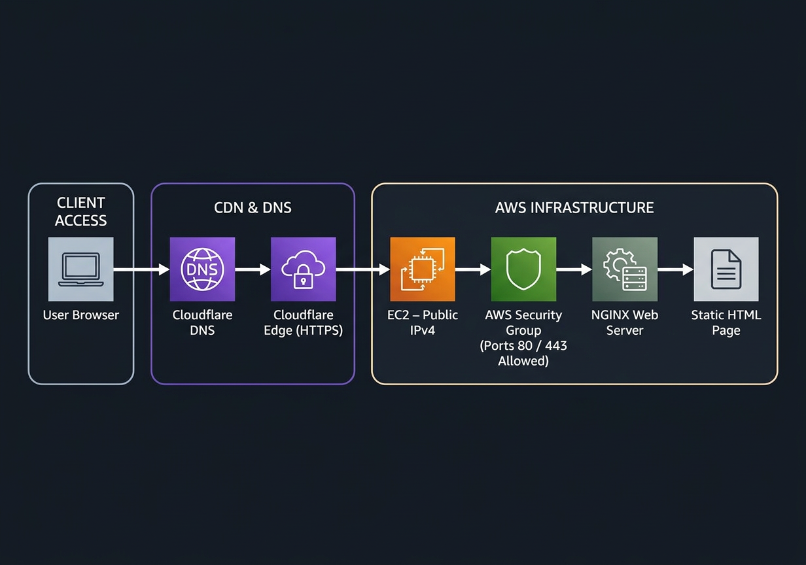
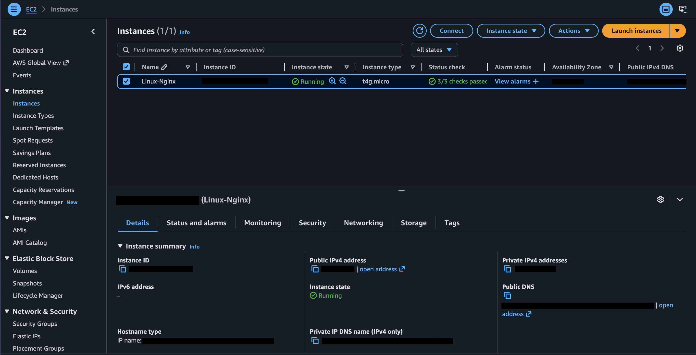
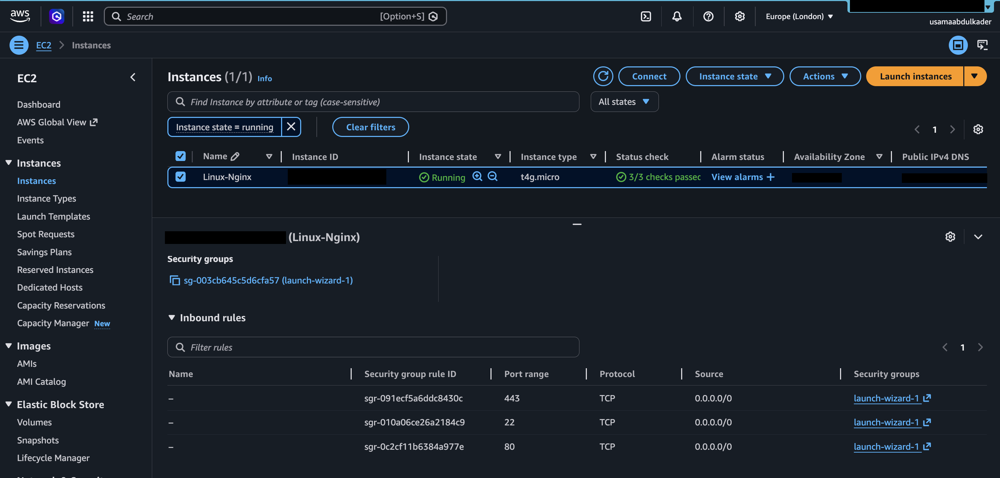
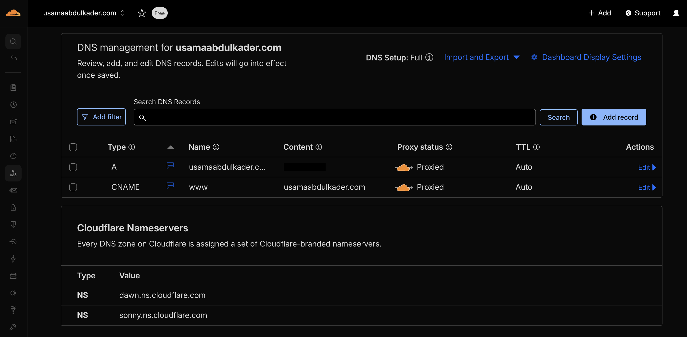
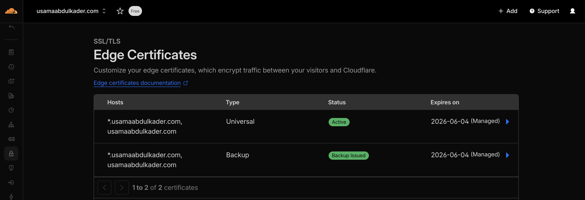

# Infrastructure Lab — AWS EC2 + NGINX + Cloudflare

A hands-on infrastructure project demonstrating how to deploy a public web server on AWS and connect it to a custom domain using Cloudflare DNS.

This project brings together several core networking and cloud concepts including DNS resolution, IP addressing, firewall rules, HTTP traffic, and Linux server configuration.

🌐 **Live Website:**  
https://usamaabdulkader.com

*(This demo will only be live temporarily for the Networking module.)*


---

# Project Summary

The objective of this project was to deploy a working web server on a cloud instance and expose it to the public internet through a custom domain.

Starting from a fresh EC2 instance, I installed and configured NGINX, connected a personal domain using Cloudflare DNS, and enabled HTTPS to serve a secure webpage.

This lab demonstrates the full flow of internet traffic from a user’s browser to a cloud-hosted web server.

---

# Tech Stack

| Layer | Technology |
|------|-------------|
| Cloud Provider | AWS EC2 |
| Operating System | Amazon Linux |
| Web Server | NGINX |
| DNS Management | Cloudflare |
| Security | AWS Security Groups |
| Access | SSH |

---

# Architecture

The following diagram illustrates how client traffic flows from a user’s browser through Cloudflare DNS and into the AWS-hosted NGINX web server.



---

# Request Flow

1. A user enters **https://usamaabdulkader.com** in their browser.
2. The browser queries DNS through Cloudflare.
3. Cloudflare resolves the domain to the EC2 public IPv4 address.
4. The request reaches the AWS Security Group.
5. The security group allows inbound HTTP/HTTPS traffic.
6. NGINX receives the request on the EC2 instance.
7. The static webpage is returned to the user’s browser.

---

# What Was Built

- A public EC2 instance running Amazon Linux
- NGINX installed and configured as the web server
- A personal domain linked to the EC2 instance via Cloudflare DNS
- Security group rules configured to allow HTTP and HTTPS traffic
- A custom HTML homepage deployed to the NGINX web root
- HTTPS enabled through Cloudflare SSL

The final result is a publicly accessible website hosted on AWS and reachable through a custom domain.

---

# Setup Process

## 1. Launch EC2 Instance

- Launch an EC2 instance using Amazon Linux
- Configure Security Group rules:

| Port | Purpose |
|-----|---------|
| 22 | SSH access |
| 80 | HTTP traffic |
| 443 | HTTPS traffic |

Connect to the instance:

```bash
ssh -i your-key.pem ec2-user@your-ec2-public-ip
````

---

## 2. Install NGINX

```bash
sudo yum update -y
sudo yum install nginx -y
sudo systemctl start nginx
sudo systemctl enable nginx
```

Verify NGINX is running:

```bash
systemctl status nginx
```

---

## 3. Deploy a Custom Webpage

Navigate to the NGINX web root:

```bash
cd /usr/share/nginx/html
```

Edit the homepage:

```bash
sudo nano index.html
```

Replace the default NGINX welcome page with your own HTML.

---

## 4. Configure DNS with Cloudflare

Create the following DNS records:

### A Record

| Type | Name | Target          |
| ---- | ---- | --------------- |
| A    | @    | EC2 Public IPv4 |

### CNAME Record

| Type  | Name | Target              |
| ----- | ---- | ------------------- |
| CNAME | www  | @ |

---

## 5. Enable HTTPS

In Cloudflare:

```
SSL/TLS → Mode → Full
```

Enable:

* Always Use HTTPS
* Automatic HTTPS Rewrites

---

# Screenshots

## EC2 Instance Running



---

## Security Group Rules



---

## Cloudflare DNS Configuration



---

## Cloudflare SSL Settings



---

## Live Website


---

# Challenges Faced

### Cloudflare Error 521

Initially the website returned a **Cloudflare 521 error**.
This occurred because the Cloudflare proxy was enabled before the EC2 server was fully reachable.

Switching the DNS record temporarily to **DNS Only** resolved the issue.

---

### DNS Propagation Delay

After updating DNS records, the domain did not immediately resolve to the EC2 instance.

Waiting several minutes allowed DNS changes to propagate globally.

---

### HTTP Showing “Not Secure”

The site initially loaded over HTTP.
HTTPS was enabled by configuring Cloudflare SSL and enabling **Always Use HTTPS**.

---

# Key Learnings

* How DNS translates domain names into IP addresses
* How AWS Security Groups function as instance-level firewalls
* How web servers handle HTTP requests
* How Cloudflare proxies and secures traffic
* How public internet traffic reaches cloud-hosted services

---

# Future Improvements

* Containerise the web server using Docker
* Automate infrastructure provisioning using Terraform
* Configure CI/CD pipeline for automated deployments
* Deploy backend services behind an NGINX reverse proxy


